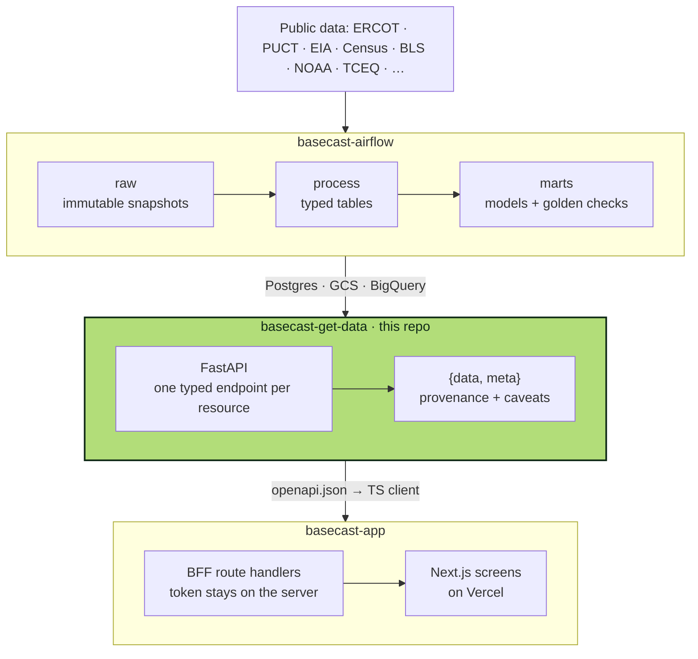
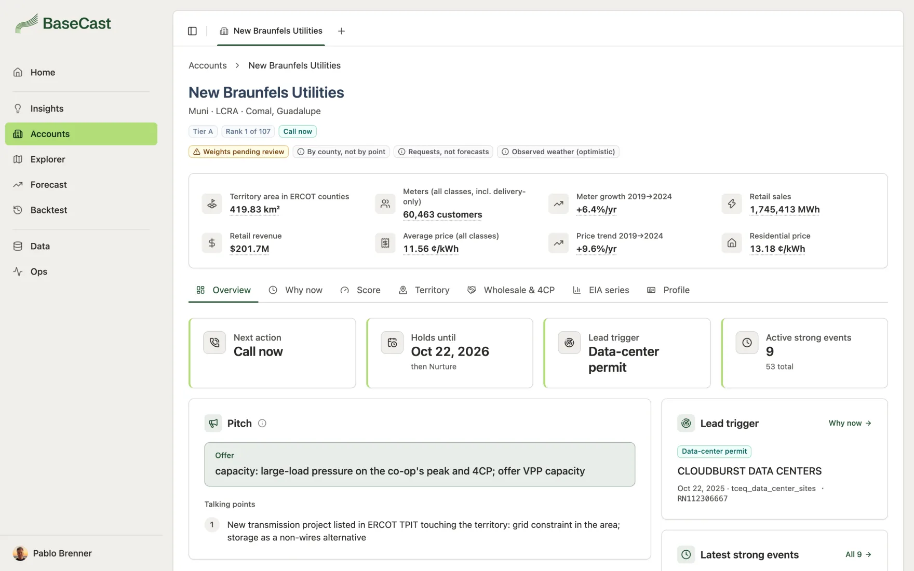

<div align="center">

<picture>
  <source media="(prefers-color-scheme: dark)" srcset="docs/assets/logo-dark.svg">
  
</picture>

### get-data

**The API behind BaseCast: one typed endpoint per resource, and every answer says where it came from.**

[](https://github.com/brennerpablo/basecast-get-data/actions/workflows/deploy.yml)


<br>


</div>

## How it fits



The pipelines write small typed **marts** to Postgres. This service loads them in memory with Polars, so the
app's filters and sliders answer in milliseconds. It also serves the raw lake, the processed tables and the
pipeline runs for the app's data browser. This repo owns the contract between the two
([docs/data-contract.md](docs/data-contract.md)), and its `openapi.json` generates the app's TypeScript client.

## Every answer carries its provenance

```jsonc
{
  "meta": {
    "data_as_of": "2026-09-26",           // the marts' as-of date
    "model_version": "a1b2c3d-accounts.1", // commit + model that built them
    "simulated": false,                    // true if any value comes from a fixture
    "verified": true,                      // false if any value was machine-read and not checked
    "sources": ["mart_accounts"],
    "caveats": [{ "code": "weights_pending_review", "label": "Weights pending review", "text": "…" }]
  },
  "data": { }
}
```

The app never writes a caveat of its own: labels and texts come from here, and every card shows them.

<p align="center">
  
  <br><sub><code>GET /accounts/{id}</code> in the app: the facts, their caveats and the call</sub>
</p>

## Endpoints

| Group | Routes |
|---|---|
| **Accounts** | `/accounts` · `/accounts/export.csv` · `/accounts/{id}` · `/accounts/{id}/events` |
| **Explorer** | `/geo/counties` · `/geo/counties/{fips}` · `/geo/zones` · `/queue/projects` |
| **Forecast** | `/forecasts/peak` · `/forecasts/large-load` · `/forecasts/queue-curves` · `/load/normalized` · `/four-cp` |
| **Backtest** | `/backtest/peak` · `/backtest/official-errors` · `/backtest/queue` |
| **Catalogs** | `/insights` · `/caveats` · `/glossary` |
| **Data browser** | `/lake/*` (sources, folders, files, previews, bytes) · `/tables/*` (schema, rows, lineage) · `/pipeline/runs` |

Every route but `/health` needs `Authorization: Bearer $API_TOKEN`. The exact shapes are in `openapi.json`,
and the interactive docs at `/docs`.

## Quickstart

```bash
uv sync
cp .env.example .env   # API_TOKEN, the local lake, Postgres through the proxy
cloud-sql-proxy --port 5439 --quota-project basecast-509812 basecast-509812:us-central1:basecast-pg
uv run uvicorn basecast_get_data.main:app --reload --port 8000   # http://localhost:8000/docs
```

<details>
<summary><b>Checks</b> (a push to <code>main</code> deploys to Cloud Run, so these pass first)</summary>

```bash
uv run ruff check . && uv run ruff format --check .
uv run pytest                                    # against tests/fixtures/lake, trimmed from real files
uv run python scripts/export_openapi.py          # after any change to a route or model; a test fails if stale
uv run python scripts/make_contract_fixtures.py  # after a change to a mart's columns (data/fixtures)
```

After exporting `openapi.json`, regenerate the app's client (`npm run api:generate` in basecast-app).

</details>

<details>
<summary><b>Data mode</b></summary>

`DATA_MODE=fixtures` serves invented fixtures (`simulated: true`, caveat `fixture`). `MARTS_LIVE` lists the
groups that read the marts instead (`accounts`, `explorer`, `forecast`, `backtest`, `insights`). `GET /health`
reports both, plus the row count of every mart loaded. Production settings are the defaults in
`basecast_get_data/config.py`; locally, `.env` points the lake at `../basecast-airflow/data`. BigQuery uses your
application default credentials.

</details>

## Docs

- [docs/data-contract.md](docs/data-contract.md): the contract (envelope, caveats, errors, which mart feeds
  each resource, pagination and filters for the data browser)
- [docs/KICKOFF.md](docs/KICKOFF.md): project kickoff (Portuguese)

<div align="center">
<sub>
<a href="https://github.com/brennerpablo/basecast-airflow">basecast-airflow</a> ·
<b>basecast-get-data</b> ·
<a href="https://github.com/brennerpablo/basecast-app">basecast-app</a>
</sub>
</div>
